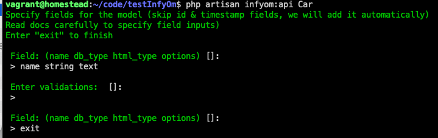
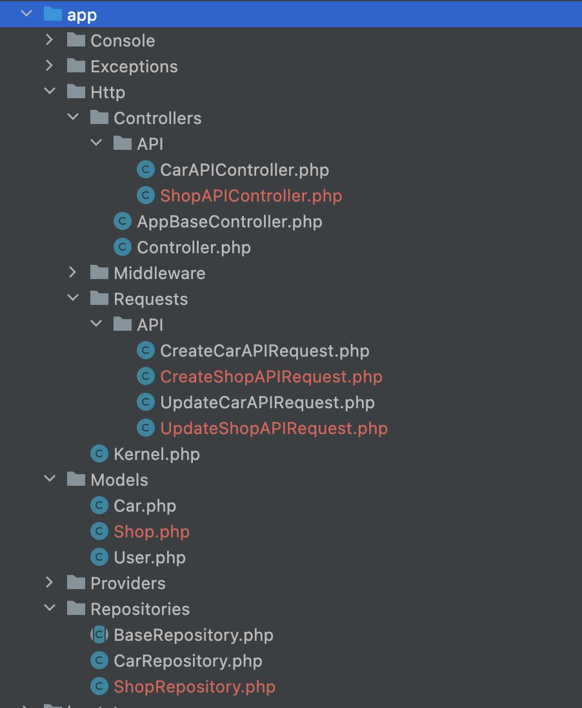
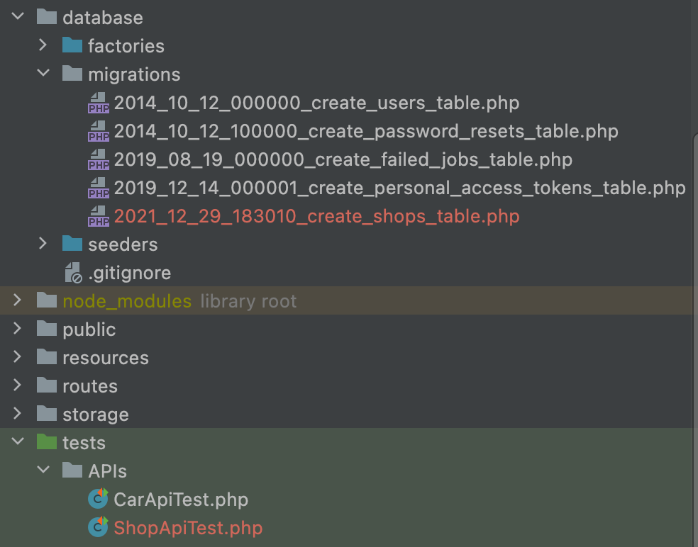
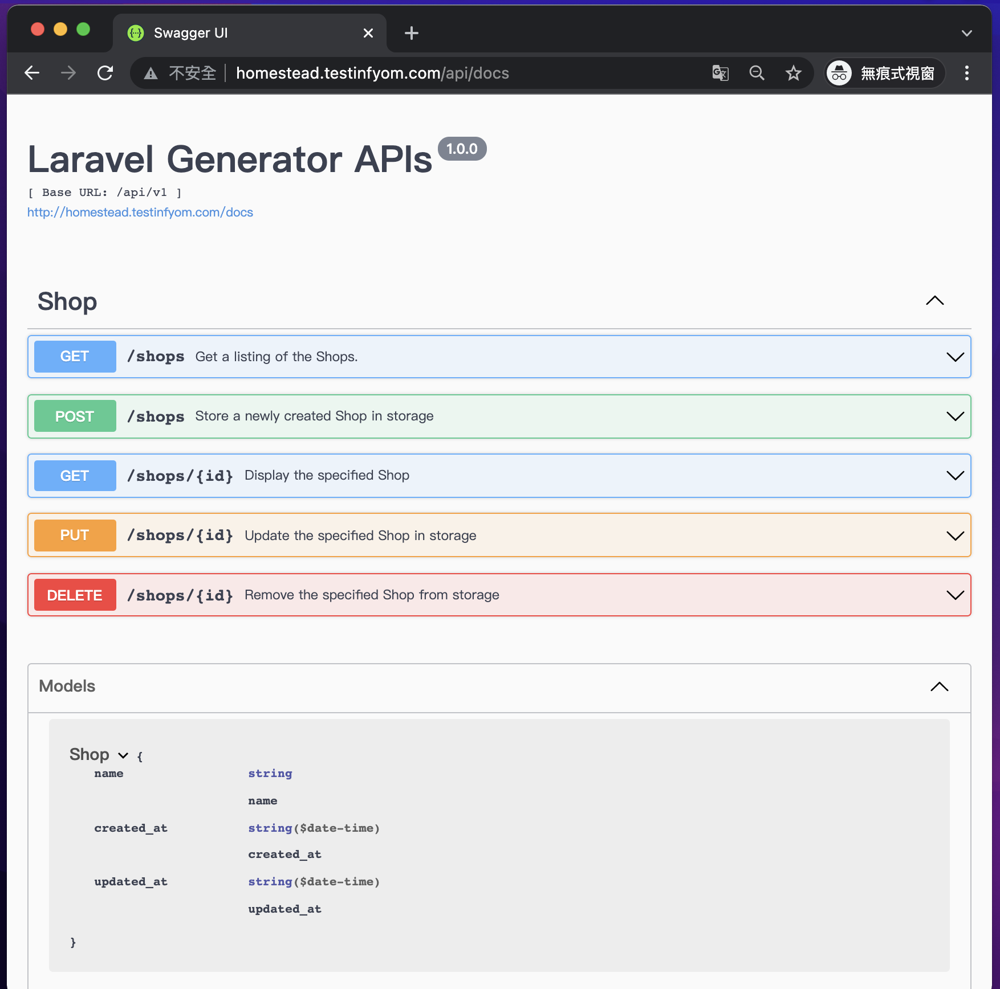

# InfyOm’s Laravel Generator 實作紀錄

- 環境:php 8.0 /  Laravel 8.0


# Part 1 . 安裝 InfyOm 基本套件

基本上可以參考 官方教學

[https://infyom.com/open-source/laravelgenerator/docs/8.0/installation](https://infyom.com/open-source/laravelgenerator/docs/8.0/installation)
直接安裝即可，這篇實作紀錄主要是從 **Installing into existing Laravel Projects 開始。**

但有一個雷要注意， **Update API Routes 時，要把** namespace那一句註解掉。

```php

Route::prefix('api')
        ->middleware('api')
        ->as('api.')
       // ->namespace($this->app->getNamespace().'Http\Controllers\API')
        ->group(base_path('routes/api.php'));
```

因為在 Laravel 8 時會發生 `Target class [App\Http\Controllers\API\App\Http\Controllers\API\CarAPIController] does not exist.` 的狀況。


# Part 2 添加swagger 套件

- 參考官方的教學  [https://infyom.com/open-source/laravelgenerator/docs/7.0/generator-options#swagger](https://infyom.com/open-source/laravelgenerator/docs/7.0/generator-options#swagger) 後，會產生 swagger doc url  [http://homestead.testinfyom.com/api/docs](http://homestead.testinfyom.com/api/docs)
- title的swagger code會放在 app/Http/Controllers/AppBaseController.php裡頭


# Part 3 透過  InfyOm 產生建立API時，自動添加 swagger 文件

- 本篇紀錄僅產生API的做法，語法如下

    ```php
    php artisan infyom:api Shop 
    
    ```

- 需要設定 filed ( model的property ,request的validation)     


  - 會產生對應的 `Migration ,Model ,Repository,Factory,Request,API Controller,RepositoryTest,ApiTest`
    <details><summary>檔案位置</summary>
    
    
      
    
    </details>
    
- 參考官方文件 [https://infyom.com/open-source/laravelgenerator/docs/7.0/getting-started](https://infyom.com/open-source/laravelgenerator/docs/7.0/getting-started)

- swagger 畫面如下



# Part 4 透過 .json 建立API

- 可從官方提供的json建立網站設定model/talbe欄位
    - [https://harish81.github.io/infyom-schema-generator](https://harish81.github.io/infyom-schema-generator/)
    - 並將檔案放在  resources/model_schemas
- 參考官方文件的 **Fields From File**  [https://infyom.com/open-source/laravelgenerator/docs/8.0/generator-options#fields-from-file](https://infyom.com/open-source/laravelgenerator/docs/8.0/generator-options#fields-from-file)

    ```php
    php artisan infyom:api Technician --fieldsFile=technician.json
    ```


- 效果同 part 3的做法，但可不用再設定 filed
